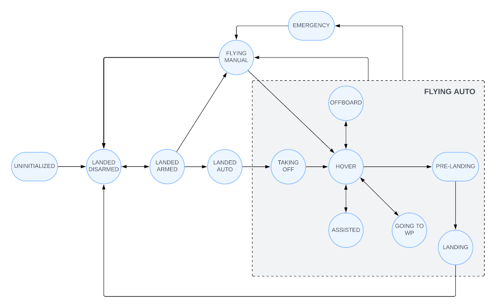

# CATEC Control Manager

This package is the core component within the CATEC's autonomy stack in GNSS-Denied environments. Its function is to handle the state of the aircraft and to manage the necessary control references according to the desired flight status.



## Dependencies

* [spdlog](https://github.com/gabime/spdlog)

```
sudo apt install libspdlog-dev
```

* [yaml-cpp](https://github.com/jbeder/yaml-cpp)

```
sudo apt install libyaml-cpp-dev
```

* ROS packages

```
sudo apt-get install ros-$ROS_DISTRO-mavros-msgs
```

* [CATEC Control Manager Msgs](https://github.com/catec/lucas/tree/main/catec_control_manager_msgs)

* [Cascade PID Controller Msgs](https://github.com/catec/lucas/tree/main/cascade_pid_controller_msgs)

## Parameters

Normally the parameters dont need to be changed. Although there may be certain speeds or accelerations that need to be adjusted depending on the dynamics of the aircraft where it is being used. To find out which parameters can be modified, see [this configuration file](./config/general_params.yaml).

## Topics

---

* Its possible to configure topics names throw launch file

### Subscribed topics


|name|type|description|
|----|----|-----------|
| /sam_odometry/base_link | [nav_msgs/Odometry](https://docs.ros.org/en/noetic/api/nav_msgs/html/msg/Odometry.html) | - |
| /mavros/state | [mavros_msgs/State](https://docs.ros.org/en/noetic/api/mavros_msgs/html/msg/State.html) | - |
| /mavros/extended_state | [mavros_msgs/ExtendedState](https://docs.ros.org/en/noetic/api/mavros_msgs/html/msg/ExtendedState.html) | - |
| /assisted_ref | [geometry_msgs/Twist](https://docs.ros.org/en/noetic/api/geometry_msgs/html/msg/Twist.html) | - |


### Published topics

|name|type|description|
|----|----|-----------|
| /catec_control_manager/state | [catec_control_manager_msgs/State](https://github.com/catec/lucas/blob/main/catec_control_manager_msgs/msg/State.msg) | - |
| /pose_reference_topic | [geometry_msgs/PoseStamped](https://docs.ros.org/en/noetic/api/geometry_msgs/html/msg/PoseStamped.html) | - |
| /twist_reference_topic | [geometry_msgs/TwistStamped](https://docs.ros.org/en/noetic/api/geometry_msgs/html/msg/TwistStamped.html) | - |
| /traj_reference_topic | [cascade_pid_controller_msgs/TrajCommand](https://github.com/catec/lucas/tree/main/cascade_pid_controller_msgs/msg/TrajCommand.msg) | - |

## Services

---

* Its possible to configure services names throw launch file.

### Services server

|name|type|description|
|----|----|-----------|
| /catec_control_manager/get_authority | [std_srvs/Trigger](https://docs.ros.org/en/noetic/api/std_srvs/html/srv/Trigger.html) | - |
| /catec_control_manager/take_off | [catec_control_manager_msgs/TakeOff](https://github.com/catec/lucas/blob/main/catec_control_manager_msgs/srv/TakeOff.srv) | - |
| /catec_control_manager/land | [std_srvs/Trigger](https://docs.ros.org/en/noetic/api/std_srvs/html/srv/Trigger.html) | - |
| /catec_control_manager/go_to_waypoint | [catec_control_manager_msgs/GoToWaypoint](https://github.com/catec/lucas/blob/main/catec_control_manager_msgs/srv/GoToWaypoint.srv) | - |
| /catec_control_manager/set_mode_hover | [std_srvs/Trigger](https://docs.ros.org/en/noetic/api/std_srvs/html/srv/Trigger.html) | - |
| /catec_control_manager/set_mode_assisted | [std_srvs/Trigger](https://docs.ros.org/en/noetic/api/std_srvs/html/srv/Trigger.html) | - |
| /catec_control_manager/set_mode_offboard | [std_srvs/Trigger](https://docs.ros.org/en/noetic/api/std_srvs/html/srv/Trigger.html) | - |


### Services client

|name|type|description|
|----|----|-----------|
| /mavros/set_mode | [mavros_msgs/setMode](https://docs.ros.org/en/noetic/api/mavros_msgs/html/srv/SetMode.html) | - |

## Usage

```
roslaunch catec_control_manager catec_control_manager.launch
```

## Help / Troubleshooting

* Contact: **Marco A. Montes Grova** (mmontes@catec.aero) or **Jose Ignacio Murillo** (jimurillo@catec.aero)

* Found a bug? Create an ISSUE!

* Do you want to contribute? Create a PULL-REQUEST!